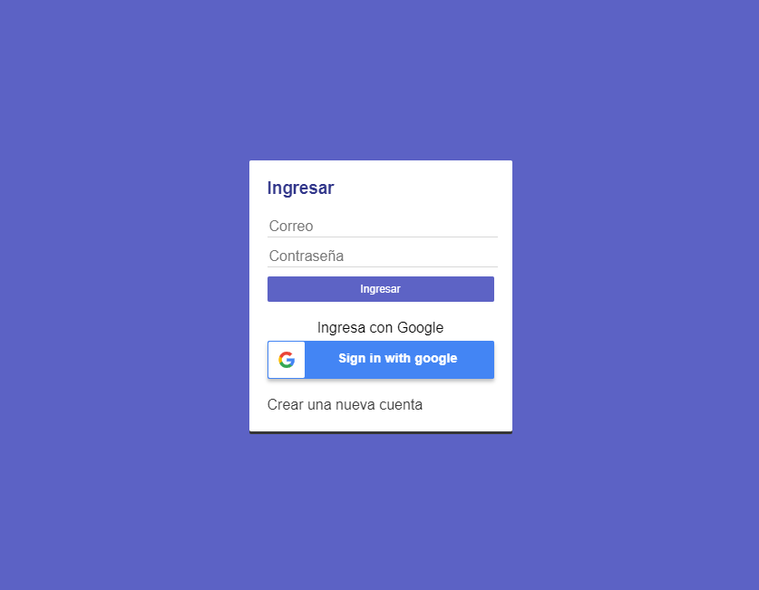

## Diario App

## Índice

* [1. Resumen del proyecto](#1-resumen-del-proyecto)
* [2. Objetivo de aprendizaje](#2-objetivo-de-aprendizaje)

***

## 1. Resumen del proyecto

Proyecto para agregar notas de tu día a día, puedes complementar con imágenes, las publicaciones pueden ser editadas y también eliminadas. Se debe inicialmente crear una cuenta para ingresar o directamente con un cuenta de Google.

## 2. Objetivo de aprendizaje

1. El objetivo principal es aprender a construir una _interfaz web_ usando
  el _framework_ elegido (React o Angular). Todos estos frameworks de
  Front-end atacan el mismo problema: **cómo mantener la interfaz y el estado
  sincronizados**. Así que esta experiencia espera familiarizarte con el concepto
  de _estado de pantalla_, y cómo cada cambio sobre el estado se va a
  ir reflejando en la interfaz.

### HTML y CSS

* [x] HTML semántico
* [x] Sass
* [x] Maquetación

### Frontend Development

* [x] Componentes
* [x] Manejo del estado

### React

* [x] [`JSX`](https://es.reactjs.org/docs/introducing-jsx.html)
* [x] [Componentes `class` y componentes `function`](https://es.reactjs.org/docs/components-and-props.html#function-and-class-components)
* [x] `props`
* [x] [Manejo de eventos](https://es.reactjs.org/docs/handling-events.html)
* [x] [Listas y keys](https://es.reactjs.org/docs/lists-and-keys.html)
* [x] [Renderizado condicional](https://es.reactjs.org/docs/conditional-rendering.html)
* [x] [Levantamiento de estados](https://es.reactjs.org/docs/lifting-state-up.html)
* [x] [`hooks`](https://es.reactjs.org/docs/hooks-intro.html)
* [x] [`CSS` modules](https://create-react-app.dev/docs/adding-a-css-modules-stylesheet)
* [x] [React Router](https://reacttraining.com/react-router/web)

### Buenas prácticas de desarrollo

* [x] Modularización
* [x] Nomenclatura / Semántica
* [x] Linting

***

### Vistas desktop

